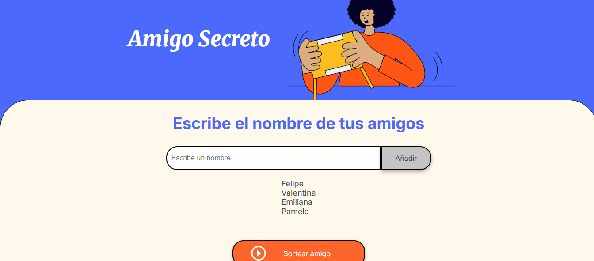
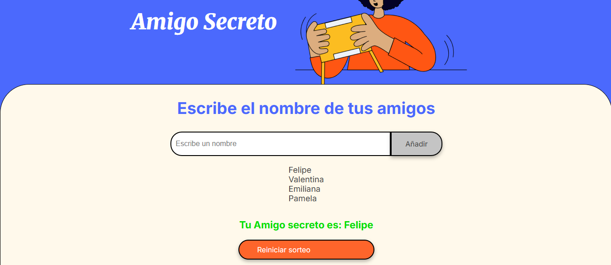

# Juego del amigo Secreto

**Amigo Secreto** es una aplicación desarrollada basado en JavaScript como parte del desafío de la formación para principiantes en programación **G8 ONE - Alura LATAM**.  
El objetivo es permitir a los usuarios ingresar nombres de amigos en una lista y realizar un sorteo aleatorio para determinar quién será el "amigo secreto".

## 📌 Índice
 
1.  [🛠️ Funcionalidades](https://github.com/pipe-ln/amigo--secreto/edit/main/README.md#%EF%B8%8F-tecnolog%C3%ADas-utilizadas) 
2. [🖼 Capturas de pantalla](#-capturas-de-pantalla)   
3. [🛠️ Tecnologías utilizadas](#️-tecnologías-utilizadas)  
4. [📦 Instalación y ejecución](#-instalación-y-ejecución)  
5. [📌 Requisitos](#-requisitos)  
6. [👨‍💻 Autores](#-autores)  
7. [📄 Licencia](#-licencia)  

## 🛠️ Funcionalidades

- **Agregar nombres**: Los usuarios pueden ingresar un nombre en un campo de texto y agregarlo a una lista visible con el botón **"Adicionar"**.
- **Validación de entrada**: Si el campo de texto está vacío, se mostrará una alerta solicitando un nombre válido y se deben ingresar un minimo de 3 nombres.
- **Visualización de la lista**: Los nombres ingresados aparecen en una lista debajo del campo de entrada.
- **Sorteo aleatorio**: Al hacer clic en **"Sortear Amigo"**, se selecciona aleatoriamente un nombre de la lista y se muestra en pantalla.
- **Reiniciar sorteo**: Al hacer clic en **"Reiniciar Sorteo"**, se limpiara toda la lista se vuelve a las condiciones iniciales.

## 🛠️ Tecnologías utilizadas

- **HTML5** + **CSS3** + **JavaScript**


### 🖼 Capturas de pantalla

#### Pantalla principal  
  

#### Después de agregar nombres  
  

#### Resultado del sorteo  
  

#### Reiniciar el sorteo


## 📦 Instalación y ejecución

1. Clona este repositorio en tu máquina local:

   ```bash
   git clone https://github.com/pipe-ln/amigo--secreto
   cd amigo--secreto

2. Abre el archivo index.html en tu navegador.

## 📌 Requisitos
Navegador web actualizado (Google Chrome, Firefox, Edge, etc.).

## 👨‍💻 Autores
- **[Felipe Lizama N](https://github.com/pipe-ln)** - Implementación de la lógica en JavaScript.  
.  
Proyecto desarrollado en el contexto del curso G8 ONE - Alura LATAM.

## 📄 Licencia
Este proyecto es open source.
